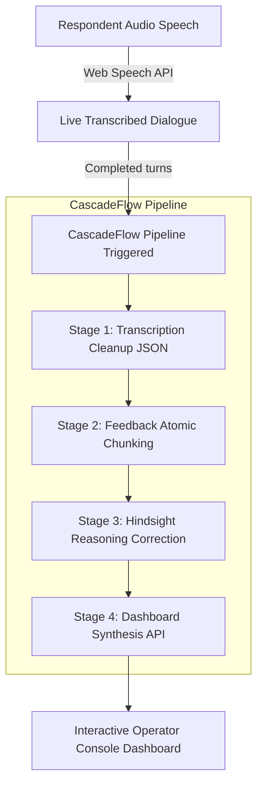

# VoicePulse — Conversational Feedback Intelligence Platform

> **"Stop filling forms. Just talk."**

VoicePulse is a voice-first feedback collection and diagnostic analytics platform. Instead of answering tedious forms or rating scales, respondents speak naturally to an empathetic, conversational AI interviewer that listens, probes deeper on vague answers, and extracts structured insights. 

Operators (product teams, educators, event organizers) get an executive console showing real-time transcript analysis, topic segmentation, contextual sentiment adjustments, and priority action lists.

---

## 🚀 Key Features

*   🎙️ **Voice-First feedback capture**: Built-in high-fidelity microphone recording and Web Speech API live transcription.
*   🧠 **Empathetic AI Conversationalist**: Custom dialogue model that leads the respondent through a friendly 3-turn interview, asking follow-up questions to gather deep qualitative details.
*   ⚡ **NVIDIA NIM Integration**: Fully powered by the state-of-the-art **`minimaxai/minimax-m2.7`** model via the high-speed OpenAI-compatible NVIDIA API.
*   🔐 **Clerk Google Sign-In**: Securely locked behind a responsive, modern Google Authentication gate powered by **`@clerk/react@latest`**.
*   📊 **CascadeFlow Sequential Pipeline**: Runs a multi-stage cognitive pipeline downstream from every audio session:
    1.  **Cleanup & Validation**: Strips stuttering and filler words (um, like, basically) and validates the JSON schema.
    2.  **Atomic Chunking**: Segments the clean transcript into specific feedback statements.
    3.  **Hindsight Correction Loop**: Runs a retrospective reasoning pass on the entire dialogue, correcting early classification errors using later context.
    4.  **Executive Synthesis**: Combines KPIs into themes, sentiment heatmap charts, high-impact quotes, and priority action tasks.

---

## 🛠️ The CascadeFlow Architecture



### Hindsight Retrospective Reasoning Example
If a respondent says *"The setup was fine"* in Turn 1, but later details *"Actually, when deploying the server, the build crashed and we spent two hours debugging a terminal error"* in Turn 3:
*   **Without Hindsight**: The platform would classify Onboarding as `positive` and Deployments as `negative`.
*   **With Hindsight**: The reasoning layer flags the early turn, updates Onboarding to `ambivalent`, and registers the reasoning: *"Respondent initially declared setup was fine, but later revealed they spent two hours debugging a build crash. Reweighted early sentiment to reflect polite compliance."*

---

## 💻 Tech Stack

*   **Framework**: [React](https://react.dev/) + [Vite](https://vite.dev/) (TypeScript template)
*   **Aesthetics & CSS**: TailwindCSS paired with Custom glassmorphism variables.
*   **Motion**: Framer Motion (`motion/react`) for immersive liquid waves and page wipes.
*   **Identity & Auth**: [Clerk React SDK](https://clerk.com/docs/react/getting-started/quickstart) (`@clerk/react`)
*   **Intelligence Engine**: [NVIDIA Integrate API](https://integrate.api.nvidia.com/) (minimaxai/minimax-m2.7 model)

---

## ⚙️ Environment Variables

Configure these in a `.env` (or `.env.local`) file in the project root:

```bash
# Clerk Google Authentication Key
VITE_CLERK_PUBLISHABLE_KEY=pk_test_YOUR_CLERK_PUBLISHABLE_KEY

# NVIDIA integrate API Key
NVIDIA_API_KEY=nvapi-YOUR_NVIDIA_API_KEY
```

---

## 🏃 Run Locally

### Prerequisites
*   Node.js (v18+)
*   npm / yarn / pnpm

### 1. Install Dependencies
```bash
npm install
```

### 2. Run in Development Mode
To launch the Vite hot-reloading dev server:
```bash
npm run dev
```
Open `http://localhost:3000/` in your browser.

### 3. Build for Production
To bundle the client assets for deployment:
```bash
npm run build
```

### 4. Type Validation and Linting
To check type safety across the repository:
```bash
npm run lint
```

---

## 🔒 Security Audits
This repository was audited for clean, correct integration and is fully compliant with the latest Clerk specifications:
*   App wrapped with `<ClerkProvider>` at the entry point `main.tsx`.
*   No manual passing of `publishableKey` as a prop in the root file.
*   Leverages modern Clerk layout controllers `<Show>`, `<SignInButton>`, `<SignUpButton>`, and `<UserButton>`.
*   Fully typecast build variables to pass all strict TypeScript compiler checks.
